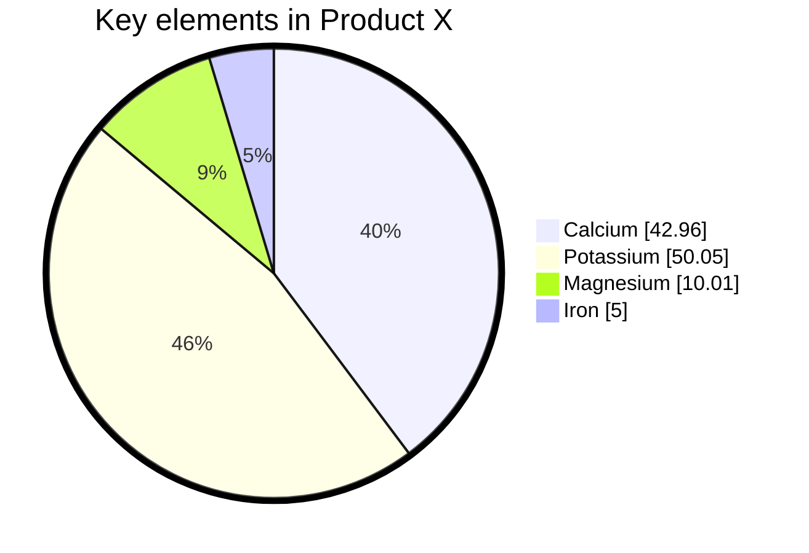

# H1
## H2
### H3
#### H4
##### H5
###### H6

Párrafo 

Si queremos poner en **negrita**

Si queremos en *cursiva*

> ### Blockquote
> Podemos anotar cosas
>1. ewdijefiiewf
>2. efrwgergrgrg
>⚠️ **Warning:** Do not push the big red button.

Listas ordenadas:
1. Sara
2. Miriam
3. Charo

Listas desordenadas:

- Manzana
- Pera
- Platano

Listas checks:

- [ ]
- [ ]

```html

<html>
    <head><head>
    <body></body>
</html>

```

Línea horizontal:
---

Links: [Guia de Markdown](markdownguide.org)

Imágenes


Tablas:
|Nombre|Apellido|Apellido2|
|-------|-------|--------|
|Edu    | Chacin|Gonzalez|
|America|Gonzalez|Ferre  |

Nota al pie de página[^1]

[^1]: Este es el texto de pie de página


### Creando un ancla {#custom-id}
[Link custom-id](custom-id)
<!--Este es el enlace al ancla -->

termino
: definición

Texto tachado:
~~ekfnpe~~

H~2~o

H^2^O

Párrafo
=========

texto ==subrayado==

Windows y el .
 ☠️🥶


 Mermaid:


 ```mermaid
 ---
title: Node
---
flowchart LR
    id

 ```


 ```mermaid
gantt
    title A Gantt Diagram
    dateFormat YYYY-MM-DD
    section Section
        A task          :a1, 2014-01-01, 30d
        Another task    :after a1, 20d
    section Another
        Task in Another :2014-01-12, 12d
        another task    :24d

 ```


 ```mermaid

 ---
title: Animal example
---
classDiagram
    note "From Duck till Zebra"
    Animal <|-- Duck
    note for Duck "can fly\ncan swim\ncan dive\ncan help in debugging"
    Animal <|-- Fish
    Animal <|-- Zebra
    Animal : +int age
    Animal : +String gender
    Animal: +isMammal()
    Animal: +mate()
    class Duck{
        +String beakColor
        +swim()
        +quack()
    }
    class Fish{
        -int sizeInFeet
        -canEat()
    }
    class Zebra{
        +bool is_wild
        +run()
    }

```



